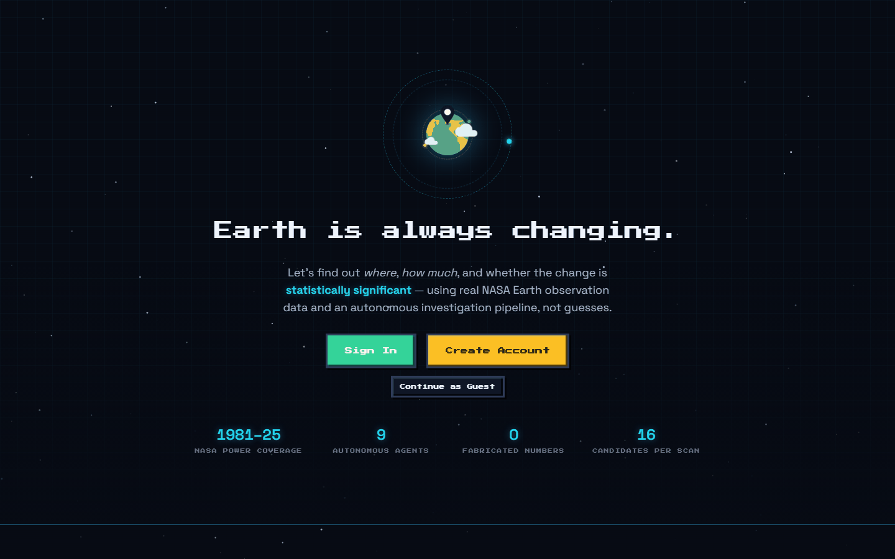
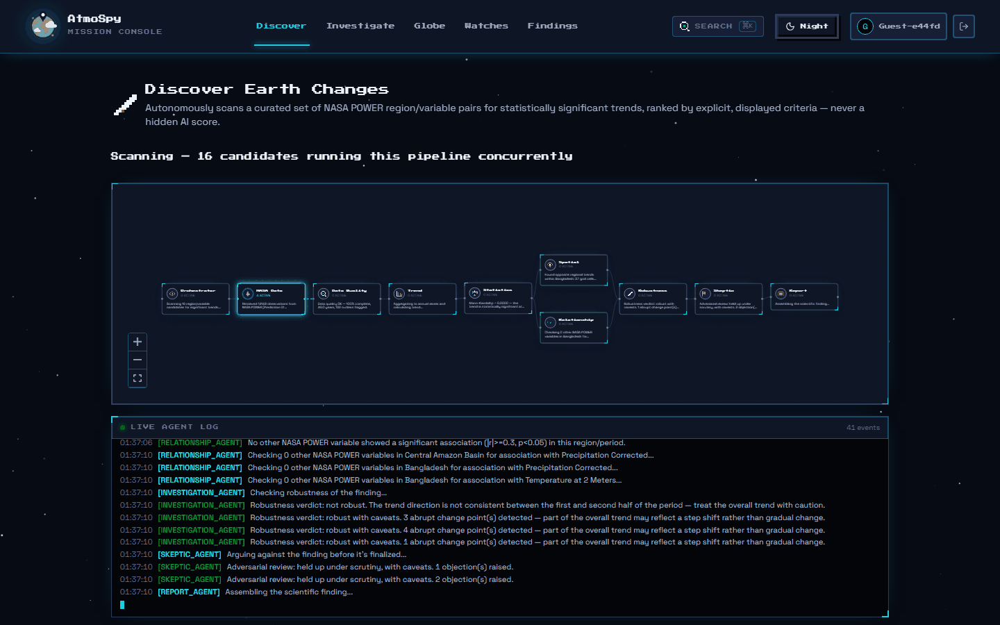
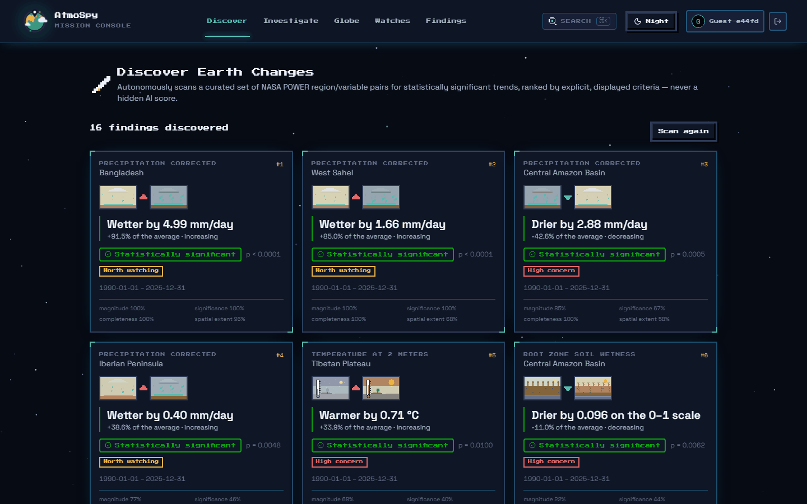
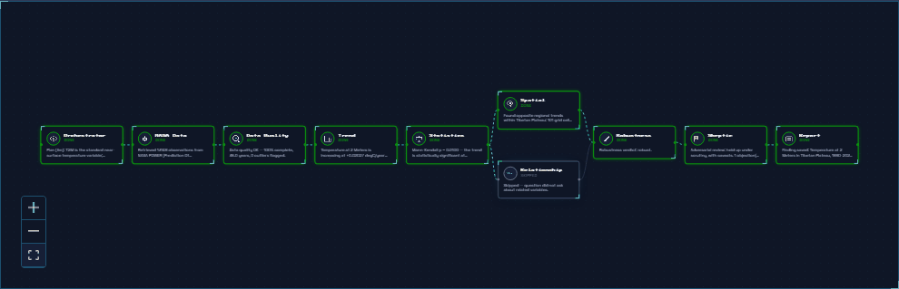
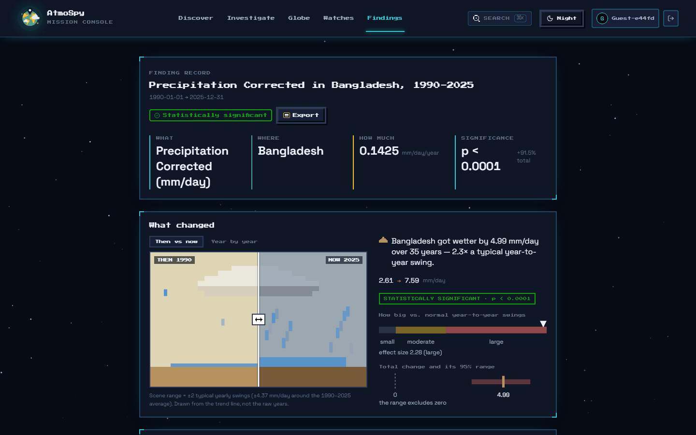
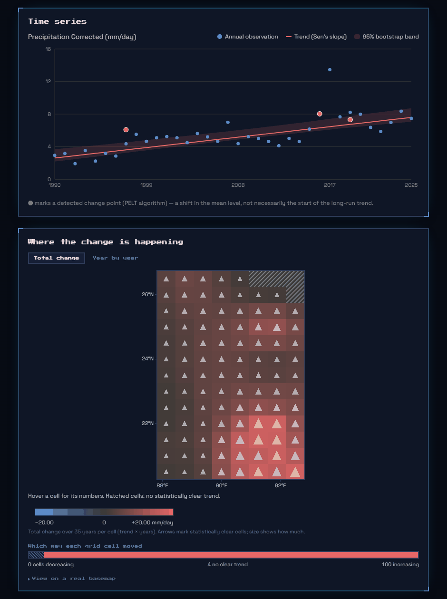
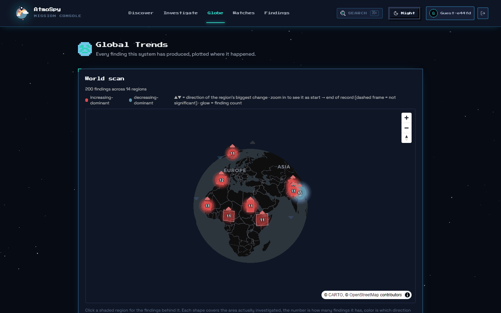

# AtmoSpy

A team of AI agents that investigates how Earth is changing, using real NASA data. Built for the NASA Space Apps Challenge 2026.

Every investigation answers four questions with real numbers:

- **What** changed?
- **Where** did it change, and does it change in opposite directions in different places?
- **How much** did it change?
- **Is the change statistically significant**, and is that the same as scientifically important?



## Features

### Discover

One click scans 16 region and variable pairs at once. Sixteen investigations run the full agent pipeline in parallel, and the results are ranked by criteria that are shown on screen: trend size, significance, data completeness, consistency over time and spatial extent. The scan keeps running if you switch pages and picks up where it left off when you return.




### Investigate

Ask a question in plain language, such as "Has temperature changed significantly in the Tibetan Plateau since 1990?" The agents plan the work, fetch the data, run the statistics and write up the result. You watch every step live as a node graph and a log.



### Finding reports

Each finding shows what changed, where, how much and how sure we are. A pixel art scene morphs from the start to the end of the record, and its size follows the effect size, not just the p value. Reports also include a time series with a confidence band, a spatial map of every grid cell, an adversarial review and a "why it may be happening" panel written from cited sources.




### Globe

Every finding plotted where it happened, with the direction of the biggest change in each region.



### Watches

Sign in to subscribe to a region and variable pair. The pipeline reruns on a schedule and flags whether anything changed since the last check.

## How it works

The project has two layers that never mix.

1. **A deterministic science core in Python.** Every number comes from NumPy, SciPy, pandas, statsmodels, pymannkendall and ruptures running on real NASA data. It has unit tests with known answers.
2. **An agent layer using GPT OSS 120B on Groq.** It plans the investigation and words the interpretation of numbers it is given. It cannot compute or invent a statistic, and a guardrail rejects any number in its output that does not trace back to the data.

Without a Groq key the app still works fully, using a rule based planner and a template narrator.

### The agents

| Agent | Job |
|---|---|
| Orchestrator | Turns the question into a plan and coordinates the rest |
| NASA Data | Fetches the daily series from NASA POWER, with caching |
| Data Quality | Checks gaps and outliers, and can force a retry with a wider window |
| Trend | Mann Kendall test, Sen's slope, percent change, change points |
| Statistics | p value, 95% confidence interval, and effect size |
| Spatial | Per cell trends across the region, flags opposite trends |
| Relationship | Correlates with other variables, reported as association only |
| Investigation | Checks whether the trend holds in both halves of the period |
| Skeptic | Argues against the finding using only numbers already computed |
| Report | Assembles the finding, and the only place an LLM is called |

### Method

- **Trend:** Mann Kendall test and Sen's slope, with OLS alongside for comparison.
- **Significance:** p value at alpha 0.05, plus a 95% confidence interval and a bootstrap band on the chart.
- **Importance:** a separate effect size (total change divided by normal year to year variation), so significant and important are never confused.
- **Change points:** the PELT algorithm.
- **Robustness:** the trend is re estimated on each half of the period, and disagreement is shown as a caveat.

## Tech stack

| Layer | Choice |
|---|---|
| Frontend | Next.js 16, TypeScript, Tailwind CSS, React Flow, Recharts, MapLibre GL |
| Backend | FastAPI, Python 3.12, async SQLAlchemy |
| Database | PostgreSQL with PostGIS (Supabase works) |
| AI | Groq, `openai/gpt-oss-120b` |
| Data | NASA POWER, with GRACE FO and SMAP when an Earthdata token is set |

## Run it locally

You need Python 3.12 or newer, Node 20 or newer and Docker.

```bash
cp .env.example .env
docker compose up -d postgres

cd backend
python -m venv .venv
.venv/Scripts/activate        # or: source .venv/bin/activate
pip install -r requirements.txt
alembic upgrade head
python -m app.db.seed
uvicorn app.main:app --reload --port 8000
```

In a second terminal:

```bash
cd frontend
npm install
npm run dev
```

Open http://localhost:3000. To run everything in containers instead, use `docker compose up --build`.

### Environment variables

| Variable | Purpose |
|---|---|
| `DATABASE_URL` | Postgres connection string |
| `GROQ_API_KEY` | Optional. Turns on LLM planning and narration |
| `NASA_EARTHDATA_TOKEN` | Optional. Turns on GRACE FO and SMAP |
| `CORS_ORIGINS` | Allowed frontend origins |
| `JWT_SECRET` | Signs login tokens. Must be changed in production |
| `NEXT_PUBLIC_API_URL` | Backend URL used by the browser |

### Tests

```bash
cd backend && pytest
cd frontend && npm run test
```

## Deployment

The frontend deploys to Vercel, the backend to Render using `render.yaml`, and the database to Supabase. Set `NEXT_PUBLIC_API_URL` on Vercel to the Render URL, then set `CORS_ORIGINS` on Render to the Vercel URL.

## Limitations

- NASA POWER is reanalysis and model data, not a direct satellite measurement.
- A regional average can hide differences inside the region. The spatial analysis reduces this but does not remove it.
- Relationships are correlations only and never claim a cause.
- Discover scans a curated list of 16 pairs, not the whole globe.
- The rate limiter, cache, event bus and Watch scheduler run in one process, so the backend is meant to run as a single instance.

## Credits

Pixel art scenery is from Kenney's [Tiny Farm](https://kenney.nl/assets/tiny-farm), released under CC0. Not an official NASA product, and NASA does not endorse this project.
